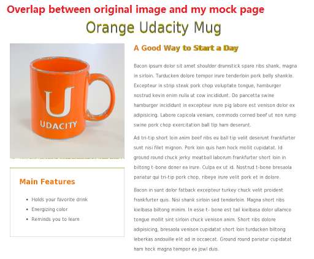

This is a project for [Front-End Web Developer Nanodegree](https://www.udacity.com/course/nd001) provided by [Udacity](https://www.udacity.com). 

In this project, I was provided with a design mockup as a picture and I was required to replicate that design in HTML and CSS. 

According to the auto-grading system, my code achieved a mismatch rate of 0.87%. Here is the overlap between target image and my mock page:

All Web sites, books, forums, blog posts, github repositories etc. that I referred to or used are listed in `references.md`. 